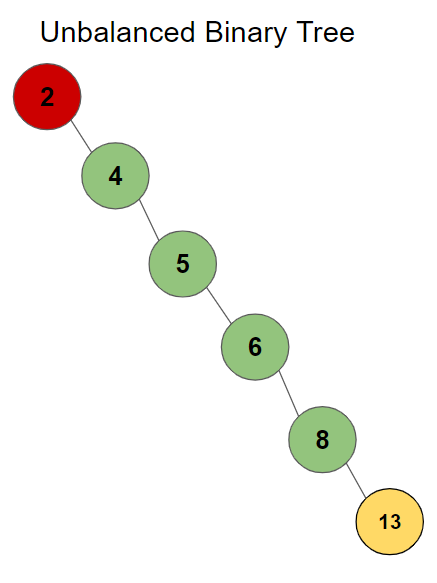

# Binary Trees

## Overview

Trees are a structure that shares some characteristics with linked-lists. A tree is a list composed of nodes with pointers where each node may have multiple pointers connected to a subsequent node. The trees we will be considering here are called Binary Search Trees.
A binary search tree is a tree where each parent node has no more than two child nodes connected to it. 

## Key Terms
- Tree: A data structure composed of linked nodes capable of linking to multiple other nodes.
- Binary Tree: A tree data structure where no more than two nodes are linked to another.
- Binary Search Tree: A tree data structure incorporating rules for linking additional nodes.
- Root: The first node in a tree.
- Leaf: Any node that does not have additional nodes linked to it.
- Parent: A node with any other node lined to it down the chain
- Child: The subsequent node that is linked to a previous node.
- Balanced: A tree with no significant difference in "height" between levels of the tree

## Binary Trees

Binary trees keep the number of child nodes restricted to no more than 2. This is advantageous when searching or adding to trees later by keeping decisions limited to a binary choice of direction down the tree. 


Here we can see the relationships between the various nodes of a tree which make up subtrees. Each layer of parent and child nodes forms a level of the tree.

## Binary Search Trees

### Sorting

Binary Search Trees are a sorted form of the tree structure. Formulas are used to add additional nodes to the tree by comparing the data to the current node beginning at the root. If the data is smaller, the sort will travel to the next layer down the left side of the parent node.
If the data is larger, the sort will travel to the next layer on the right side. This assessment is continued until the data reaches a node with a valid open link. A pointer is made and the data is linked to the tree. 

As a visual example, lets take the binary tree shown below. We want to add the value 13 to the tree sorting it to the proper location. 


For each layer, we assess if the value is less than or greater than the current node. 

1. The new node is greater than the root node, traverse to the right.
2. The new node is less than 15, traverse to the left.
3. The new node is greater than the leaf node 8. The new node is linked to the leaf node. This makes 13 the new leaf node.


### Efficiency

Using the same method to add nodes, we can also search if a node exists on the tree. In other structures like an array lor linked list, this process has **O(n)** efficiency as each value must be checked until the desired value is found.
The structure of a binary tree effectively allows us to cut the time needed to locate a value by disregarding superflous values from the search bringing us to an efficiency of **O(logn)**. However, this is only the case when
a tree is balanced.

## Balance

Consider if we created the tree by adding the values in ascending order. The result is a binary search tree, but every value is linked to the right of the parent node changing our efficiency back to **O(n)**. 



We see that we have ended up with a linked list with no gains in efficiency.

### Balanced Binary Search Trees

Balanced binary search trees consist of a layout where there is no dramatic difference between the heights of subtrees. It cannot be assumed that data will always enter a system in a way that will result in a balanced tree. Thus, a number of algorithms
have been designed to rebalance the data of trees. The exact function of these algorithms is beyond the scope of this tutorial, but we can see an example representative of how one such algorithm, an Adelson-Velskii and Landis tree, works to balance a binary tree.

**Balanced Binary Tree**


**A value is added which unbalances the tree**


**The AVL algorithm performs a node rotation, altering the positions of the unbalanced branch**


Through this process, the algorithm will detect any new imbalances to the tree and automatically sort them into even subtrees. 

## Operations

The nature of binary search trees may involve more complicated operations to be performed to achieve a desired outcome. We will focus here on inserting new values into a tree and traversing the contents of a tree. The nature of the binary search tree
makes both of these operations have **O(logn)** efficiency. 

### Inserting Nodes

Inserting a new node to a tree is a recursive process. Our two necessary conditions for a recursive functions are the problem being addressed and the base case. The problem being broken down is adding the new node to the left or right side of
each subtree. The base case occurs when there is a place to insert the node onto a subtree. Each subtree is assessed to see if the new node goes to the left or right. Once the direction is decided, we check if the space is empty. When the tree is still populated,
we call the recursive function to check the next subtree.
```python
def insert(self, data):
	"""
	Insert 'data' into the BST.  If the BST
	is empty, then set the root equal to the new 
	node.  Otherwise, use _insert to recursively
	find the location to insert.
	"""
	if self.root is None:
		self.root = BST.Node(data)
	else:
		self._insert(data, self.root)  # Start at the root

def _insert(self, data, node):
	"""
	This function will look for a place to insert a node
	with 'data' inside of it.  The current subtree is
	represented by 'node'.  This function is intended to be
	called the first time by the insert function.
	"""
	if data < node.data:
		# The data belongs on the left side.
		if node.left is None:
			# We found an empty spot
			node.left = BST.Node(data)
		else:
			# Need to keep looking.  Call _insert
			# recursively on the left subtree.
			self._insert(data, node.left)
	elif data >= node.data:
		# The data belongs on the right side.
		if node.right is None:
			# We found an empty spot
			node.right = BST.Node(data)
		else:
			# Need to keep looking.  Call _insert
			# recursively on the right subtree.
			self._insert(data, node.right)
```

In the above example, a node is defined as an object of class BST.Node. The Node class is called an inner class because it's defined inside the BST class. The Node class contains three things: data (the value), left (pointer to the left node), 
and right (pointer to the right node). We use two functions to add the new node to the tree. The **insert** function is what calls the recursive function **_insert**. It also contains a condition if there is no current root node. This function serves
as a wrapper function, supporting the recursive insert function. To review, a wrapper function can be used in conjuction with a recursive function to hold data or additional logic required for the proper use of the recursive calls. 

### Traversing

We can traverse a tree if we are looking to display all of the data or as a search process to locate a particular node. This is also a recursive process where the problem is to traverse the left and right nodes of the parent node. The base case would 
be once there are no further nodes in the tree. We can traverse a tree forward or in reverse as we did with a regular linked list. Some additional notes: The initial function serves to get the next node in the tree. Yield is a term in python which allows 
the program to return a value while still continuing the function after.

```python
def __iter__(self):
	"""
    Perform a forward traversal (in order traversal) starting from 
    the root of the BST.  This is called a generator function.
    This function is called when a loop	is performed:

	for value in my_bst:
		print(value)

	"""
	yield from self._traverse_forward(self.root)  # Start at the root

def _traverse_forward(self, node):
	"""
	Does a forward traversal (in-order traversal) through the 
	BST.  If the node that we are given (which is the current
	subtree) exists, then we will keep traversing on the left
	side (thus getting the smaller numbers first), then we will 
	provide the data in the current node, and finally we will 
	traverse on the right side (thus getting the larger numbers last).

	The use of the 'yield' will allow this function to support loops
	like:

	for value in my_bst:
		print(value)

    The keyword 'yield' will return the value for the 'for' loop to
    use.  When the 'for' loop wants to get the next value, the code in
    this function will start back up where the last 'yield' returned a 
    value.  The keyword 'yield from' is used when our generator function
    needs to call another function for which a `yield` will be called.  
    In other words, the `yield` is delegated by the generator function
    to another function.

	This function is intended to be called the first time by 
	the __iter__ function.
	"""
	if node is not None:
		yield from self._traverse_forward(node.left)
		yield node.data
		yield from self._traverse_forward(node.right)
```

## Methods

| Operation/Method     | Use               | Big O Efficiency                                                       |
| -------------------- | ----------------- | ---------------------------------------------------------------------- |
| insert(value)        |insert a new value |O(logn), recursively search the tree for an open node                   |
| remove(value)        |Removes value from |O(logn), recursively search the tree of the correct value and remove it |
|                      |the tree           |This may require adjusting the tree composition.                        |
| contains(value)      |Check if the value |search the subtrees to                                                  |
|                      |is in the tree     |find the value                                                          |
| Traverse fwd/reverse |Visit all values in|O(n), recursively traverse the subtrees from the given side first       |
|                      |the given order    |traverse the subtrees                                                   |
| height(node)         |Determine the hight|O(n), recursively search the left and right subtrees and return the     |
|                      |or a node          |higher value between the two subtrees                                   |
| size()               |Return the size of |O(1), tree size is a known element of the class                         |
| empty()              |Returns a bool if  |O(1), compare size to 0                                                 |
|                      |the root is empty  |                                                                        |

# Example Problem - Binary Value Search

Here is a simple example of traversing a binary search tree to check for a value within the tree. This is a representation of the **contains(value)** operation above. We will need
our main class Node to create a node on the tree. Our BST class contains functions to initiate the tree and search for values. **search()** is the function which executes the search for the value
and calls the **_search_recursive()** function. For this example, we'll just make a binary tree with some random values. We could also recursively populate our own tree to perform the test. 

```python
class Node:
    def __init__(self, value):
        self.value = value
        self.left = None
        self.right = None

class BST:
    def __init__(self, root):
        self.root = root

    def search(self, value):
        return self._search_recursive(self.root, value)

    def _search_recursive(self, node, value):
        if node is None:
            return False
        if node.value == value:
            return True
        return self._search_recursive(node.left if value < node.value else node.right, value)

# Hardcoded binary search tree as a variable
root = Node(5)
root.left = Node(3)
root.right = Node(7)
root.left.left = Node(2)
root.left.right = Node(4)
root.right.left = Node(6)
root.right.right = Node(8)

# Create BST instance with the root node
test_bst = BST(root)

# Example usage:
# Search for values in the test tree
print(test_bst.search(4))  # Output: True
print(test_bst.search(9))  # Output: False
print(test_bst.search(7))  # Output: True
```

A recursive search function has a performance of O(logn). Binary search trees are a very efficient way to store and search for data since we can use the subtrees to decrease the scale of the search.

# Problem - Lowest Common Ancestor

Write a program that finds the lowest common ancestor of 2 values in a binary search tree. The lowest common ancestor is the lowest level subtree node that is connected to both values.
```python
#         14
#       /   \
#      6     20
#     / \    / \
#    0  12  16 22
#      / \
#     9   13
```

For example, if the two values you were analyzing were 16 and 22, the lowest common ancestor would be 20. In another case, if the numbers are 0 and 9, the lowest common ancestor would be 6. 

Write a function to recursively search through the tree and indentify the lowest common ancestor. The functions for creating the tree will be provided for you. When found, print the lca value to the terminal.

```python
class Node:
    def __init__(self, val=0, left=None, right=None):
        """
        Initialize a node in a binary tree.

        Parameters
        - val: Value of the node (default is 0)
        - left: Left child of the node (default is None)
        - right: Right child of the node (default is None)
        """

        self.val = val
        self.left = left
        self.right = right

def lowest_common_ancestor(root, l, r)
    """
    Find the lowest common ancestor (LCA) of two nodes in a binary search tree.

    Parameters:
    - root: Root node of the binary search tree
    - l: First node
    - r: Second node

    Returns:
    - Node: LCA of the two input nodes
    """
    pass

# Test Cases:
root = Node(6)
root.left = Node(2)
root.right = Node(8)
root.left.left = Node(0)
root.left.right = Node(4)
root.right.left = Node(7)
root.right.right = Node(9)
root.left.right.left = Node(3)
root.left.right.right = Node(5)

test1 = lowest_common_ancestor(root, root.left.left, root.left.right.right)
print(test1.val)   # Output: 2 (0 and 5)
test2 = lowest_common_ancestor(root, root.right.left, root.right.right)
print(test2.val)   # Output: 8 (7 and 9)
test3 = lowest_common_ancestor(root, root.left.right.left, root.right)
print(test3.val)   # Output: 6 (3 and 8)
test4 = lowest_common_ancestor(root, root.left, root.left.right)
print(test4.val)   # Output: 2 (2 and 4)
```

When finished, check your code compared to the solution: [Solution](lca.py)

[Return to Welcome Page](welcome.md)
