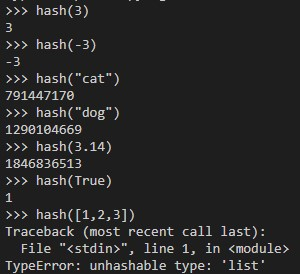

# Sets

## Overview

A Set is a data structure in Python that looks very similar to a list or array. In contrast to other structures in Python though, the order of items within a set is irrelevant to the functionality. Python lists or stacks can have multiple duplicate values where 
stacks can only have unique values. This makes it easier to identify elements within a set because we can user operations to find and edit elements with a high degree of efficiency. Sets are capable of storing multiple types of data
 including strings, ints, or booleans.

## Key Terms
- Set: A data structure which is defined by characteristics of being unordered and containing no duplicate values.
- Hashing: The process by which items within a set can be access and modified by a defined index location.
- Hashing Function: The function that assigns items to a numerical index within a set.
- Sparse List: A set which is not completely filled.
- Open Addressing/Chaining: Operations to resolve conflicts when managing a set.

## Comparisons

Sets share components with multiple other data structures in Python. the most obvious comparison is to a list. The structure appears similar but a set cannot have duplicates and the order of items is irrelevant. This is because we don't access items in a set by index 
but by looking for the element itself. Dictionaries are ordered and can be changed unlike sets but also do not allow duplicates just like sets. Dictionaries can also hold multiple types of data. We can also access items in a dictionary by referencing the key value pair we want without having to search each element of the dictionary 
giving it an O(1) efficiency.
```python
# List
my_list = [1, 5, 4, 2, 2, 3]   # Duplicate values are allowed in lists
item = my_list[1]   # Element accessed by index
```
```python
# Dictionary
my_dict = {"first: 1, "second": 2, "third": 3}   # No duplicate keys
item = my_dict["first"}   # Access items by referencing the key:value pair
```

```python
# Set
thisset = {"grape", "banana", "cherry", 4, 2}   # No specific order
if "apple" in thisset:  # Check and access an item without using an index
	print("apple")
else:
	print("no")
```

## Hashing

### Efficiency

Hashing is important for facilitating the 0(1) efficiency that sets have. Searching through an entire list one item at a time has an efficiency of 0(n). This is because the time it takes to find the item in the list is directly proportional to its position. To have O(1) efficiency, we would need to know exactly where the desired item's index is from the beginning. There is a way to know the item's position though. In a set, every item has a defined location sored as what is called a **hash**. Then a program can simply look for the hash and get the item immediately. 

### Hash Function

This is accomplished through hashing. Lets look at a real world example: You have a collection of movies across several shelves. You could search through the entire
collection to try and find the movie you want, but you might have to check the entire collection before you find it! Hashing lets you assign each movie a value based on its location. Each of the values is now a part of a map
of your collection. The next time you look for a movie, you can pull out the map and find the value of the movie you want so you can go directly to the right shelf to find it. 

For a programming example, lets say we want to make a list of all values from 0 to 9. The function **index(n) = n** could help us achieve this. Each value would determine its position in the list. If we add n = 7, the index in the list would also be 7. This example would require that the list be size 10 exactly. 
  
| 0 | 1 | 2 | 3 | 4 | 5 | 6 | 7 | 8 | 9 |
|---|---|---|---|---|---|---|---|---|---|
|   | 1 |   |   | 4 |   |   | 7 | 8 |   |

With a few other values added to the list, we can see how the formula works for finding elements. Our formula lets us find values because we've mapped their locations to an index. This in particular is a sparse set because it may not have values in every available space.
This also helps illustrate that there can only be one spot for any value because there would be nowhere for a duplicate to go since the space is already full.

### hash()

In cases where we have to perform operations as a part of creating a set, we can use the built in hash(n) function. Non-integer values will be converted into a value that will vary between individual runs but will always be consistent within a single execution. The only item that cannot be hashed with this method is a list.



Between these different methods we can create a few different kinds of hashing functions for different purposes.
- index(n) = n: Assign a value an index equal to it. Good for small sets or numeric values.
- index(n) = n % sparse_list_size: Similar to the basic function but allows us to break down larger data sets to save space when assigning indexes.
- index(n) = hash(n) % sparse_list_size: Works with non integer values converting them to integers that can be broken down to save storage space.

## Conflicts

When inputting different series of values into a set, conflicts can arise when our function attempts to store large quanitites of data in a small set. Think about how much space would be needed to store a million values in a set. What if that number goes to a billion? We can save space by breaking down the data into smaller index values by using % modulus. Lets go back and consider our movie collection again. What if we have space in our collection for 1,000 movies? As the collection grows, we need more and more storage space for the possible index values of our collection. With **index(n) = hash(n) % sparse_list_size** we can reduce the number of storage slots needed in our system to a small set of possible index values like 0-9 again. We hash 4 of our movie titles which results in the following index values:

- **(n) = hash(stringa) % 10 = 2**
- **(n) = hash(stringb) % 10 = 3**
- **(n) = hash(stringc) % 10 = 7**
- **(n) = hash(stringd) % 10 = 8**
 
| 0 | 1 |    2    |    3    | 4 | 5 | 6 |    7    |    8    | 9 |
|---|---|---------|---------|---|---|---|---------|---------|---|
|   |   | stringa | stringb |   |   |   | stringc | stringd |   |

This works great as long as each value we store reduces to a unique index. But what if we try to add stringj and using our hashing function **(n) = hash(stringj) % 10** results in an index value of 2? Now we have two values attempting to fill the same spot. To store the data we need to resolve the conflict. There area a couple of ways to resolve it each with varrying effects on the functionality of the set. **Open Addressing** performs an operation on our index value shifting it to the next position in the set until there is an empty space. Now each movie so far has a unique place, but if the next movie title we hash results in an index value of 4, we would have to keep moving down the line potentially creating a conflict with every additional title we store.

| 0 | 1 |      2      |    3    |      4      | 5 | 6 |    7    |    8    | 9 |
|---|---|-------------|---------|-------------|---|---|---------|---------|---|
|   |   |   stringa   | stringb | **stringj** |   |   | stringc | stringd |   |
|   |   | **stringj** | ------> |  -----/\    |   |   |         |         |   |

The other option is through **Chaining**. instead of looking for a new place to put the movie title we can store them in a single spot if we change the data type. Remember that sets can store lists as values. Now we have a list of duplicate index values in each space preventing compounding conflicts as more and more data is added in. Generally chaining is preferable when trying to work with quanitities of data. 

| 0 | 1 |             2            |    3    | 4 | 5 | 6 |    7    |    8    | 9 |
|---|---|--------------------------|---------|---|---|---|---------|---------|---|
|   |   |   [stringa, **stringj**] | stringb |   |   |   | stringc | stringd |   |

### Effects on Efficiency

The above strategies work well in our example of storing large groups of data while conserving storage space but it is not without a cost to our program efficiency. Having the index value correlate to a single piece of data is what allows us to have an efficiency of O(1) because there is a single unique location to find that data in. In the case of chaining, our efficiency would decrease to O(n) as we have to search through the list for the correct data we want. This creates a give and take where we would want to expand the size of the sparse set to reduce conflict but such a change may also lower performance due to increased storage requirements. 

## Applications

Sets have a variety of useful characteristics for storing data. They are highly efficient for adding, removing or locating elements and there cannot be duplicate data which decreases redundancy. Lists with duplicates can be easily converted to a set as Python will automatically remove any duplicates when populating the set. We don't have to worry about the order of data since hashing lets us find the exact location of data when searched for. There are mathematical operations that benefit from sets such as identifying common values between data sets and uniting all values between two sets without duplicating values.

## Set Methods

| Operation/Method     | Use               | Python Syntax        | Big O Efficiency      |
| -------------------- | ----------------- | -------------------- | --------------------- |
| Create set           |making a new set   | my_set = {1, 2, 3}   |                       |
| Create empty set     |initialize an empty| my_set = set()       |                       |
| add(value)           |Add (value) to the | stack.append(value)  | O(1) single operation |
|                      |set                | my_set.add(value)    | adding to the set     |
| remove(value)        |Removes value from | my_set.remove(value) | O(1) single operation |
|                      |the set            |                      |removing from the set  |
| member(value)        |Determines if value| if value in my_set:  |O(1) hashing the value |
|                      |is in the set      |                      |assuming good conflict |
|                      |                   |                      |resolution             |
| size()               |Returns number of  | length = len(my_set) | O(1) returning the    |
|                      |items in the set   |                      |size of the array      |
| Like values          |Finds common values|my_set = intersection(|                       |
|                      |within a set       |set1, set2)           |                       |
| Combine              |Combines two sets  |my_set = union(set1,  |                       |
|                      |                   |set2)                 |                       |

# Example Problem - Unique Elements

We're going to practice with sets by writing a function to take a list of elements and return a list with only the unique values. 

Requirements:
- Creat a function to fill a set with unique values
- The function must be able to take a list of different types of values including string, int, and bools
- The function should be able to process lists of mixed types

```python
def find_unique_items(array):
    # Create an empty set to store unique names
    unique_elements = set()

    # Iterate through the list of elements adding each value to the set
    for item in array:
        unique_elements.add(item)

    # Print the results
    print(find_unique_items(input))

# Test the function
# Test 1
strings = ["Elephant", "Banana", "Sunshine", "Laptop", "Bicycle", "Chocolate", "Rainbow", "Mountain", "Galaxy", "Adventure", "Banana", "Sunshine", "Chocolate"]   # Answer: {"Elephant", "Banana", "Sunshine", "Laptop", "Bicycle", "Chocolate", "Rainbow", "Mountain", "Galaxy", "Adventure"}
# Test 2
ints = [10, 25, 7, 42, 13, 56, 89, 2, 35, 18]   # Answer: {10, 25, 7, 42, 13, 56, 89, 2, 35, 18}
# Test 3
mixed = [42, "hello", True, "world", False, 0, 10, "python", True]   # Answer: {False, True, 'world', 42, 10, 'hello', 'python'}
```
Notice on Test 3 that 0 did not get added to the new set. This is because Python treats 0 and False as the same and 1 and True as the same meaning that there can only be one when adding to a set.

# Problem - 
