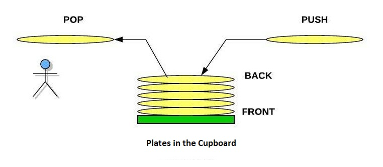

# Stacks

## Overview

List or arrays are a feature of all programming languages. Their usefulness allows us to apply them in a number of unique ways. The Stack is an application of Python lists characterized by the order that elements are added or removed.

## Key Terms

- Stack: A data structure which is dependent on the order in which elements are added or removed with the Last In, First Out rule.
- LIFO: Last In, First Out. Items entered last in the list are the first to be removed.
- Front: The first index of the stack, most often index 0.
- Back: Then end of a Stack where push and pop operations are performed.
- Push: An operation that adds a new item onto the back of the stack
- Pop: An operation that removes an existing item from the back of a stack

## Stacks in the Real World

It is almost certain that you have interacted with stacks in the real world during day-to-day activities. 

### Dishes

Consider when you would put away dishes in the cupboards. Each time you stack a plate or bowl in the cupboard, you are performing what we would term a **PUSH** operation. Once the dishes are all put away, we can realize that the dishes must be removed from the top first in order to get to the first one you put down. Of course, for this example the bottom of the stack would be the front and the top would be the back of the stack. When you go to set out the dishes again, you are executing a **POP** operation by removing the plates one by one from the top of the stack. Removing from the middle of the stack would be more difficult in this example and we wouldn't 
pull from the middle of a python stack either. All operations are performed from the back of the stack.



### Undo Function

A more direct example of a stack in everyday use is the Undo function in word processors or text editors. Consider a sentence being typed as a stack where each word is added to a stack. We would read the sentence from the screen as "Every good boy does fine." In a python list, this may appear as:
```python
sentence = ["Every", "good", "boy", "does", "fnie"]
```

Each word is appended onto the sentence forming the stack. When we make a mistake like in this example, we simply enter the Undo command which pops the most recent word from the stack
```python
sentence = ["Every", "good", "boy", "does", "fnie"]
edit = input()
if edit == "undo":
    sentence.pop()
print(sentence)
```
leaving the new sentence as "Every good boy does". The stack maintains the history of a series of items so we can perform operations related to the sequence of events.

## Methods

We've already explored push and pop operations a little so far. All operations that modify the stack do so starting from the end of the stack only. For this we use .append(x) to add and .pop() to remove items. There are additional methods that we can use to analyze the state of a stack. Notice that the efficiency of these operations is always O(1).

| Operation/Method     | Use               | Python Syntax        | Big O Efficiency      |
| -------------------- | ----------------- | -------------------- | --------------------- |
| push(value)          |Add (value) to the | stack.append(value)  | O(1) single operation |
|                      |end of the stack   |                      | adding to the array   |
| pop                  |Removes and returns| value = stack.pop()  | O(1) single operation |
|                      |the last element   |                      |removing from the array|
| size()               |Returns the size of| length = len(stack)  | O(1) single operation |
|                      |the stack          |                      | returning the size    |
| empty()              |Returns true if the| if len(stack) == 0   | O(1) single operation |
|                      |length is 0        |                      | adding to the array   |

## The Function Stack

To this point, we have actually been utilizing stacks in every program we have written anytime we call a function. The function call essentially tells the computer we want to: call x function, and where to return to when done. Calling the function is easy to visualize when we initiate a function call. But what about when the function needs to call a series of other functions to finish? This is done by creating what's called a call stack. When a function is called, it is pushed to the back of the stack. Each successive function call is pushed to the stack until the last function is resolved. It is then removed from the stack and each previous function executes in its time and is removed until the stack is cleared. This is sometimes referred to as unwinding the call stack.


### Recursion

While another topic, call stacks are an essential element of using recursion in programming. Recursion is the process of a function iteratively calling itself until a desired end case is reached. Each call to itself is added to the call stack. Once the end case is reached, each occurence of the call is resolved as the stack unwinds. This can appear as if the function is holding on to each iteration of return values until resolving them all once the end condition is met. 

# Example Problem - Text Editor

Let's return to the text editor example from earlier. We can write a simple program illustrating the process of a stack by having a user enter a string and execute an undo function if they want to edit something they previously wrote. 

Requirements:

- Create a class to initialize the stack and manage adding or removing items
- Get user input in the form of a string
- Push the words of the string into the stack and display the current string
- Ask if the user wants to undo something and remove the last element of the stack if requested

```python
class Stack:
    """
    Implement the Stack data structure. The functions below
    will encompas the initialization of the stack and functions for 
    adding or removing from the sentence stack. 
    """

    def __init__(self):
        '''
        Initialize the data structure as an empty list
        '''
        self.word_stack = []

    '''
    Add a word to the back of the stack
    '''
    def add_word(self, word):
        self.word_stack.append(word)

    '''
    Remove the last word entered from the stack. If the stack is empty,
    display a message to the user.
    '''
    def undo(self):
        if self.word_stack:
            self.word_stack.pop()
        else:
            print("Nothing to undo.")

def main():
    print("Welcome to the text editor.")
    editor = Stack()   # Create a new instance of the stack class to hold the user input

    while True:   # Set the program to constantly read user input and add it to the stack
        user_input = input("Enter a word (press Enter to finish, 'undo' to undo): ")

        if not user_input:   # If the player presses Enter with no other input, end the loop
            break

        elif user_input.lower() == 'undo':   # Remove the last entered word from the sentence
            editor.undo()

        else:
            words = user_input.split()   # Break up the string into a list of each word separated by blank space

            for word in words:   # For each word in the list, add it to the editor stack and display the current sentence when finished
                editor.add_word(word)
            print("Current sentence:", ' '.join(editor.word_stack))

    print("Final sentence:", ' '.join(editor.word_stack))   # When the user has finished, display the final sentence

'''
Execute the main function
'''
main()
```

This example takes input from the user storing it when they indicate the input is done allowing for further edits until they are finished. Notice the while loop is always set to True to allow the user to continuously 
edit the string. This can be done through a boolean flag to check if the user pressed enter or didn't enter any input and would generally be preferred over using the break keyword.

# Problem - Inversion Check

Write a program that takes alist of integers and checks if it is the same when reversed. You must use stacks to accomplish this program. The program should return True or False based on the result. The program must be able to handle both strings and lists. (Hint: you do not need to make a class to make or modify the class for this problem)

Execute the following test cases:
check_reverse([18, 15, 20, 1, 20, 15, 18])  # Test 1: True
check_reverse([5, 7, 9, 2, 8, 6, 4, 1, 3, 3, 1, 4, 6, 8, 2, 9, 7, 5])  # Test 2: True
check_reverse([42, 17, 36, 42, 16, 42])  # Test 3: False
check_reverse([])  # Test 4: True

When finished, check your code compared to the solution: [Solution](stacksolution.py)

[Return to Welcome Page](welcome.md)
